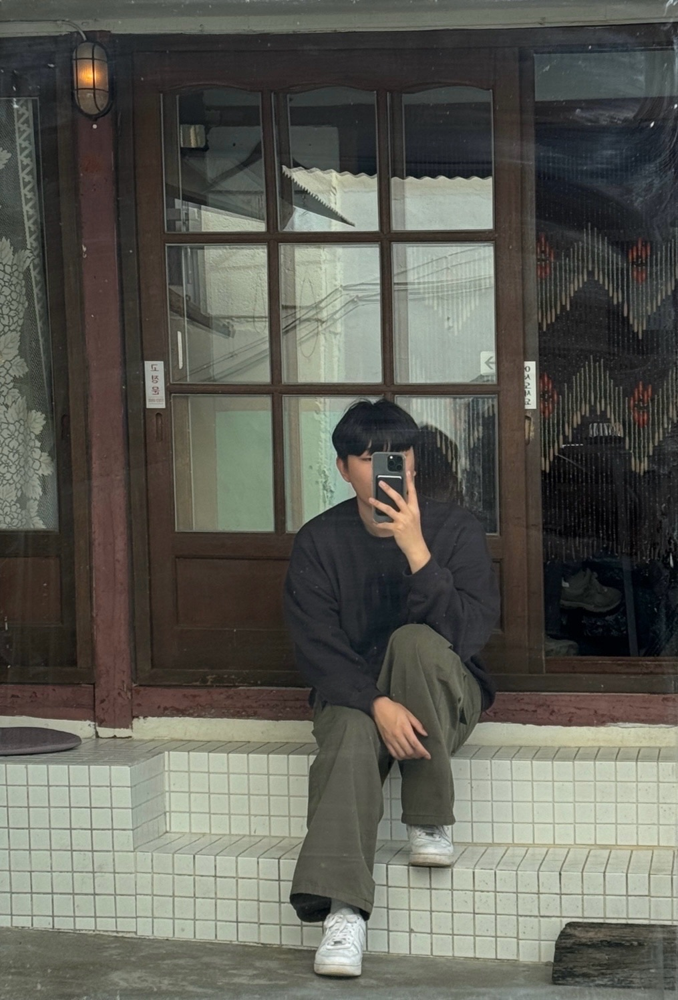

---
# Leave the homepage title empty to use the site title
title:
date: 2022-10-24
type: landing

sections:
  - block: markdown
    content:
      title:
      text: |
        

          <!-- 왼쪽: 프로필 사진과 이름, 학교 정보 -->
          

            
            
An Hyun

            
Jeonbuk National University

            
Department of Computer Science and Engineering

          

          <!-- 오른쪽: 소개 정보 -->
          

            
About Me

            

              I'm An Hyun, a third-year computer engineering and science student at JBNU. I want to be a back-end developer. 
              <a href="https://github.com/slyhyun" target="_blank" style="text-decoration: underline; color: #946efd;">Go To Github</a>
            

          

        

    design:
      columns: '1'
      background:
        image:
          filename: star.jpg
          filters:
            brightness: 0.5
        overlay:  # 오버레이 추가
          color: '#ffffff'  # 흰색
          opacity: 0.5  # 투명도 조절
    button:
      text: 최근 작성 문서
      url: uploads/document.pdf
  
  
  - block: features
    id: features
    content:
      title: Tech Stack
      text: 
      items:
        - name: Python
          icon: python
          icon_pack: fab
        - name: C/C++
          icon: copyright
          icon_pack: fas
        - name: Java
          icon: java
          icon_pack: fab
        - name: Node.js
          icon: node-js
          icon_pack: fab
        - name: React
          icon: react
          icon_pack: fab
        - name: Spring Boot
          icon: leaf
          icon_pack: fas

  - block: slider
    content:
      slides:
        - title: Back-end
          content: Spring Boot, Node.js, Django
          align: center
          background:
            image:
              filename: code1.jpg
              filters:
                brightness: 0.5
            position: center
            color: '#000'
        
        - title: Front-end
          content: React, Vue.js, Angular
          align: center
          background:
            image:
              filename: code2.jpg
              filters:
                brightness: 0.5
            position: center
            color: '#000'
          
        - title: Artificial Intelligence
          content: Natural Language Processing, Computer Vision
          align: center
          background:
            image:
              filename: researchpaper.jpg
              filters:
                brightness: 0.5
            position: center
            color: '#000'
    design:
      # Slide height is automatic unless you force a specific height (e.g. '400px')
      slide_height: '350px'
      slide_width: '100px'
      is_fullscreen: false
      # Automatically transition through slides?
      loop: true
      # Duration of transition between slides (in ms)
      interval: 3000

  - block: collection
    content:
      id: section-1
      title: Academic
      subtitle:
      text:
      count: 3
      offset: 0
      order: desc
      filters:
        folders:
          - course
    design:
      view: community/custom_compact
      columns: '2'

  - block: collection
    content:
      id: section-2
      title: Activity
      subtitle:
      text:
      count: 3
      offset: 0
      order: desc
      filters:
        folders:
          - department
          - club
    design:
      view: community/custom_card
      columns: '2'

  - block: collection
    content:
      id: section-3
      title: Project
      subtitle:
      text:
      count: 3
      offset: 0
      order: desc
      filters:
        folders:
          - personal
          - team
    design:
      view: community/custom_showcase
      columns: '2'
      flip_alt_rows: true

  - block: contact  # contact 블록의 '-' 기호를 들여쓰기를 통해 해결
    content:
      title: Contact
      contact_links:
        - icon: instagram
          icon_pack: fab
          name: slyhyun_
          link: https://www.instagram.com/slyhyun_
        - icon: github
          icon_pack: fab
          name: slyhyun
          link: https://github.com/slyhyun
      address:
        street: JBNU Chambit Hall 1, No. 524
        city: Jeonju
        region: Jeollabuk-do
        postcode: '54896'
        country: Republic of Korea
        country_code: KO
      coordinates:
        latitude: '35.850785'
        longitude: '127.126310'
      directions: 
      autolink: true
    design:
      columns: '3'
---
