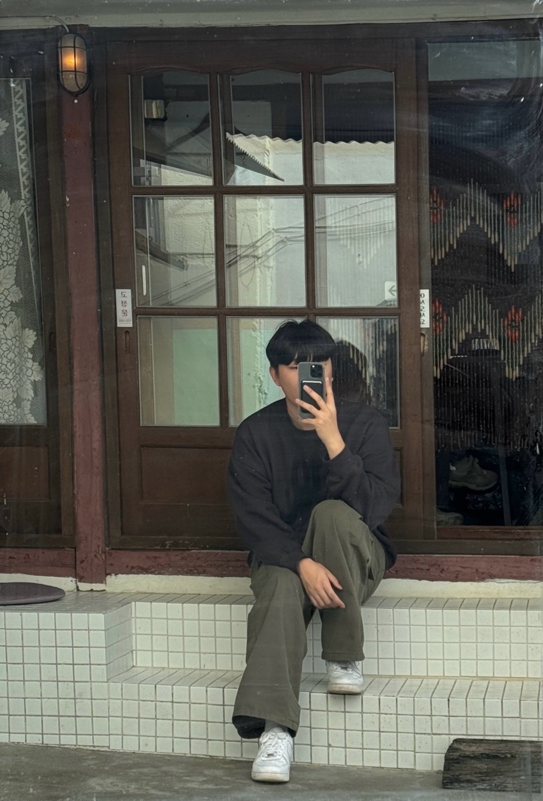

---
# Leave the homepage title empty to use the site title
title:
date: 2022-10-24
type: landing

sections:
  - block: markdown
    content:
      title:
      text: |
        

          <!-- 왼쪽: 프로필 사진과 이름, 학교 정보 -->
          

            
            
안현

            
전북대학교

            
컴퓨터공학부

          

          <!-- 오른쪽: 소개 정보 -->
          

            
자기소개

            

              전북대학교 컴퓨터공학부 3학년 안현입니다. 백엔드 개발자를 지망하고 있습니다. 
            

          

        

      button:
        text: 최근 작성 문서
        url: uploads/document.pdf
    design:
      columns: '1'
      background:
        image:
          filename: star.jpg
          filters:
            brightness: 0.5
        overlay:  # 오버레이 추가
          color: '#ffffff'  # 흰색
          opacity: 0.5  # 투명도 조절
  
  - block: features
    id: features
    content:
      title: 기술 스택
      text: 
      items:
        - name: 파이썬
          icon: python
          icon_pack: fab
        - name: C/C++
          icon: copyright
          icon_pack: fas
        - name: 자바
          icon: java
          icon_pack: fab
        - name: 노드js
          icon: node-js
          icon_pack: fab
        - name: 리액트
          icon: react
          icon_pack: fab
        - name: 스프링부트
          icon: leaf
          icon_pack: fas

  - block: slider
    content:
      slides:
        - title: 백엔드
          content: 스프링부트, 노드js, 장고
          align: center
          background:
            image:
              filename: code1.jpg
              filters:
                brightness: 0.5
            position: center
            color: '#000'
        
        - title: 프론트엔드
          content: 리액트, 뷰js, 앵귤러
          align: center
          background:
            image:
              filename: code2.jpg
              filters:
                brightness: 0.5
            position: center
            color: '#000'
          
        - title: 인공지능
          content: 자연어 처리, 컴퓨터 비전
          align: center
          background:
            image:
              filename: researchpaper.jpg
              filters:
                brightness: 0.5
            position: center
            color: '#000'
    design:
      # Slide height is automatic unless you force a specific height (e.g. '400px')
      slide_height: '350px'
      slide_width: '100px'
      is_fullscreen: false
      # Automatically transition through slides?
      loop: true
      # Duration of transition between slides (in ms)
      interval: 3000

  - block: collection
    content:
      id: section-1
      title: 학업
      subtitle:
      text:
      count: 3
      offset: 0
      order: desc
      filters:
        folders:
          - course
    design:
      view: community/custom_compact
      columns: '2'

  - block: collection
    content:
      id: section-2
      title: 활동
      subtitle:
      text:
      count: 3
      offset: 0
      order: desc
      filters:
        folders:
          - department
          - club
    design:
      view: community/custom_card
      columns: '2'

  - block: collection
    content:
      id: section-3
      title: 프로젝트
      subtitle:
      text:
      count: 3
      offset: 0
      order: desc
      filters:
        folders:
          - personal
          - team
    design:
      view: community/custom_showcase
      columns: '2'
      flip_alt_rows: true

  - block: contact  # contact 블록의 '-' 기호를 들여쓰기를 통해 해결
    content:
      title: 연락처
      contact_links:
        - icon: instagram
          icon_pack: fab
          name: slyhyun_
          link: https://www.instagram.com/slyhyun_
        - icon: github
          icon_pack: fab
          name: slyhyun
          link: https://github.com/slyhyun
      address:
        street: 전북대학교 참빛 1관, 524호
        city: 전주시
        region: 전라북도
        postcode: '54896'
        country: 대한민국
        country_code: KO
      coordinates:
        latitude: '35.850785'
        longitude: '127.126310'
      directions: 
      autolink: true
    design:
      columns: '3'
---
